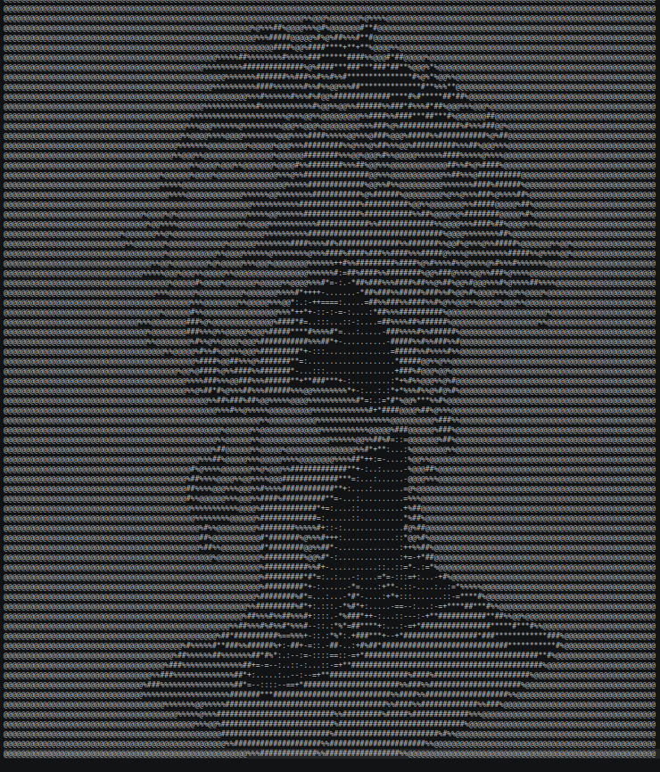

# Matrix ASCII Art Generator 🟢

Convert any image into ASCII art, rendered in a Matrix-style green terminal theme.

```
python main.py cat.jpg
```

## Features

- ✅ Converts any image (jpg, png, etc.) into ASCII art
- ✅ Matrix-style bright green terminal output
- ✅ Adjustable output width
- ✅ Saves plain ASCII art to a `.txt` file
- ✅ `--no-color` flag for plain black-and-white output

## How it works

1. The image is resized to fit the terminal width (with a height correction,
   since terminal characters are taller than they are wide).
2. It's converted to grayscale, so every pixel becomes a single brightness
   value from 0 (black) to 255 (white).
3. Each pixel's brightness is mapped to a character from darkest to
   lightest: `@%#*+=-:. `
4. The characters are printed in bright green to get the "Matrix" look.

## Setup (Linux)

```bash
git clone https://github.com/<your-username>/matrix-ascii-art.git
cd matrix-ascii-art

python3 -m venv .venv
source .venv/bin/activate

pip install -r requirements.txt
```

## Usage

```bash
# Basic usage
python main.py cat.jpg

# Custom width (more characters = more detail)
python main.py cat.jpg -w 150

# Custom output file
python main.py cat.jpg -o result.txt

# Plain ASCII, no color
python main.py cat.jpg --no-color
```

## Example

Input: a photo of a cat
Output (terminal): the same photo rendered as green ASCII characters,
and a text file (`output.txt`) with the plain version.

## Roadmap / Ideas for later

- [ ] Live webcam mode (convert each frame in real time)
- [ ] Matrix "rain" intro animation before the image settles
- [ ] Colored ASCII art (not just green) using the image's real colors
- [ ] Web version where users upload an image in the browser

## Built with

- [Pillow](https://python-pillow.org/) — image loading and processing
- [colorama](https://pypi.org/project/colorama/) — terminal colors

---

Part of a daily coding challenge — one small, complete project at a time.
